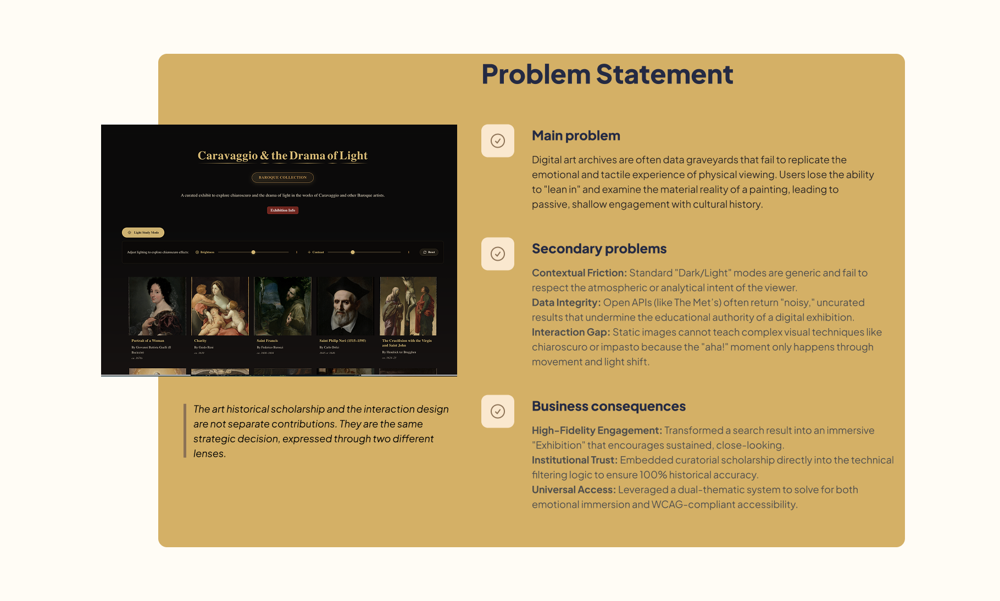
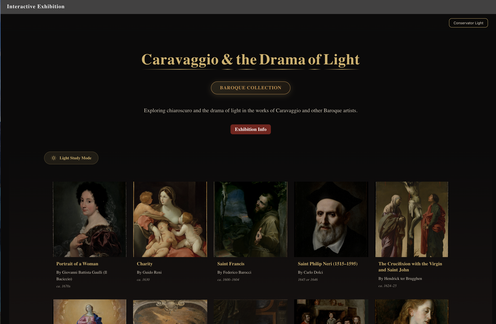
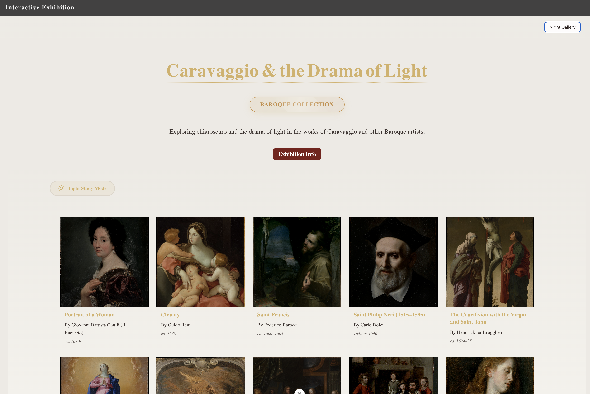
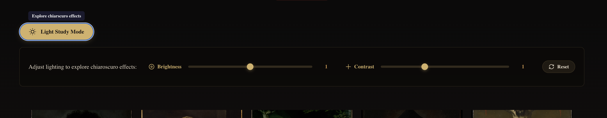

#  Exhibition Engine — Baroque Chiaroscuro Study
How do you translate the physical 'Weight' of the Old Masters into a digital environment? This project is a technical exploration of Digital Stewardship, using the Metropolitan Museum of Art’s collection to redefine the virtual gallery experience.A curated virtual gallery built with Vue 3, exploring chiaroscuro and Baroque artistry through the Metropolitan Museum of Art's public API. Contextual artwork facts surfaced per piece — highlights Met collection status, artist biography details, and period context.

**[Live App](https://jjlindsey.github.io/interactive-exhibit/#/)**


## Overview
The virtual gallery pulls live data from The Met Collection API to present an immersive, museum-style experience centered on Caravaggio and the Baroque tradition. Visitors can explore artwork, examine details up close, and learn about the dramatic use of light that defines the period. A custom Vue 3 logic layer that validates metadata against historical date ranges (1580–1750), ensuring the digital archive remains academically rigorous and historically accurate.

Chiaroscuro means “light-dark” in Italian and describes the dramatic lighting technique that gives depth and realism to scenes. While the use of chiaroscuro dates back to the Renaissance, it was popular during the Baroque period by artists like Caravaggio, who used it to heighten emotional intensity.

### Features
- Gallery Grid — Browse Baroque artworks fetched dynamically from The Met's open-access collection
- Custom Vue composable (useMetArtAPI) with multi-layer filtering — API results are validated against Baroque date ranges and     period metadata client-side to ensure exhibition accuracy
- Artwork Detail Modal — Click any piece to open a full-screen view with:
  * Zoom & pan (click to toggle 2.5× magnification, mouse-tracking zoom)
  * Metadata: title, artist, date, medium, dimensions, culture, department
  * Credit line and direct link to the Met Museum website

- Light Study Mode — Adjust simulated lighting to explore chiaroscuro effects interactively, revealing brushwork and materiality hidden at standard scale.
- Glossary / Exhibition Info Dialog — Contextual information about Baroque art and key terms
- Theme Toggle — Switch between light and dark exhibition themes
- Smooth transitions — Vue <Transition> animations on modal open/close and panel reveals

### Tech Stack
| Layer | Technology |
| ------ | ------------- |
Framework | Vue 3 (Composition API) 
Data | The Metropolitan Museum of Art Collection API
Styling | Scoped CSS with CSS custom properties
Animations | Vue Transitions + CSS keyframes

### API
This project uses The Metropolitan Museum of Art's free, open-access API — no API key required.
Base URL: https://collectionapi.metmuseum.org/public/collection/v1

### Project Structure
```
src/
├── components/
│   ├── GalleryGrid.vue       # Main artwork grid
│   ├── ArtworkModal.vue      # Detail view with zoom
│   ├── GlossaryDialog.vue    # Exhibition info & art terms
|   ├── ArtworkCard.vuw       # Artwork
│   └── ThemeToggle.vue       # Light/dark theme switcher
├── views/
│   └── GalleryPage.vue       # Main page layout
├── composables/
│   └── useMetArtAPI.js       # fetch & filter artwork from Met API
└── styles/
    └── exhibition-theme.css  # CSS variables & themes
```
### Technical Highlights
- **Zoom & Pan on Artwork Images:**
  Implemented a click-to-toggle magnification system on the artwork modal using Vue's computed styles and ref tracking. Mouse position is captured relative to the image container and mapped to transform-origin percentages, creating a natural zoom-follows-cursor effect without any external library.
- **Light Study Mode:**
  Built an interactive lighting control panel that lets visitors explore simulated chiaroscuro effects in real time. The panel uses Vue's <Transition> with a slide animation for a polished reveal, keeping the UI uncluttered until the feature is needed.
- **Met Museum API Integration:**
  Fetches live artwork data from The Metropolitan Museum of Art's open-access Collection API, handling edge cases like missing images (fallback placeholder), absent metadata fields, and linking back to the canonical object page on the Met's website.
- **CSS-Only Tooltips via data- attributes:**
  Added accessible hover tooltips using pure CSS with attr(data-tooltip) and ::after pseudo-elements — no JavaScript or tooltip library needed.

### Go to Design Case Study
[View Product Case Study(PDF)](public/ImmersiveGalleryProductDesignReduce.pdf)

#### Problem Statement


#### Gallery Dark mode


#### Conservator Light mode


#### Light Study open


### License
© Jennifer Lindsey. All rights reserved. Available for review; not licensed for reuse.
Artwork data and images are provided by The Metropolitan Museum of Art under their Open Access policy.
